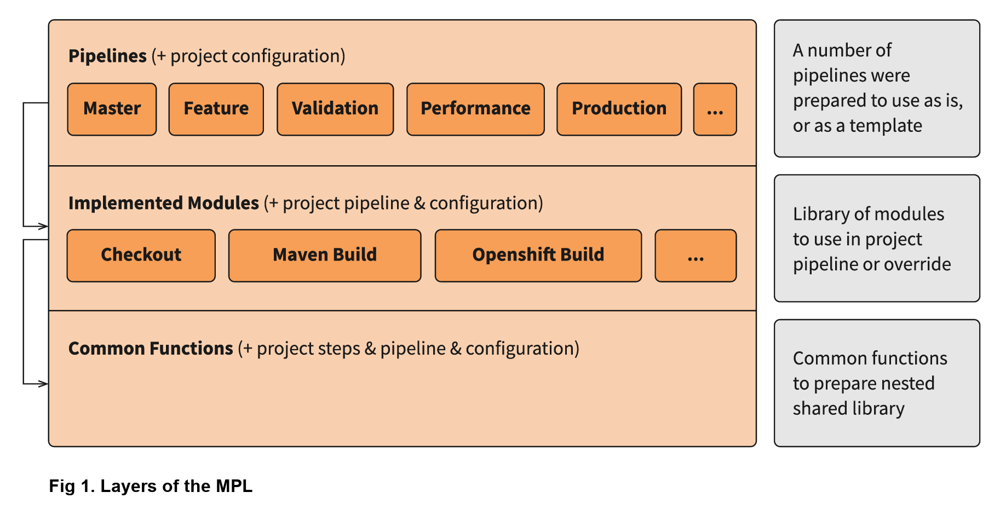
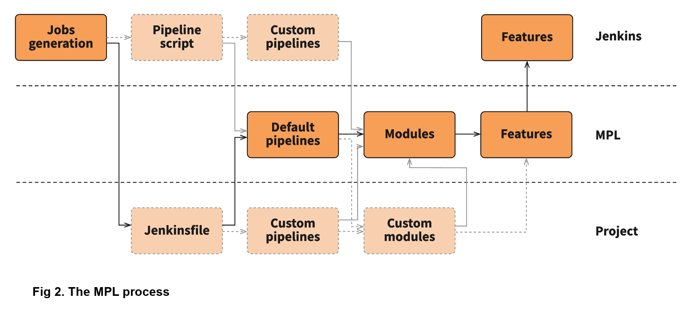
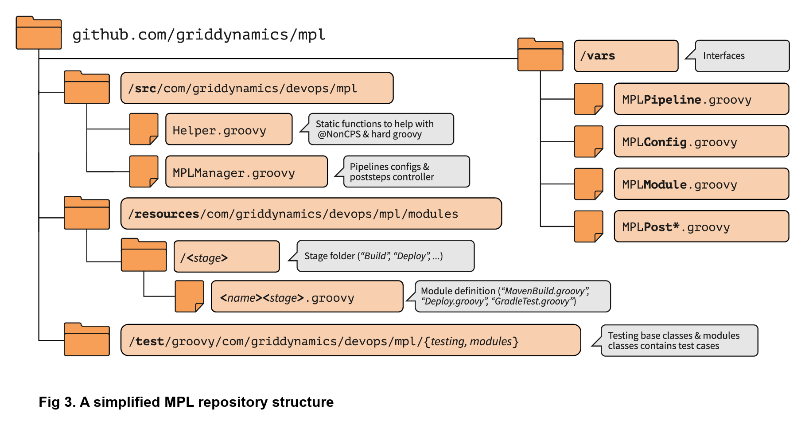
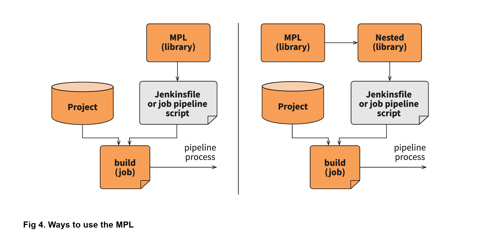
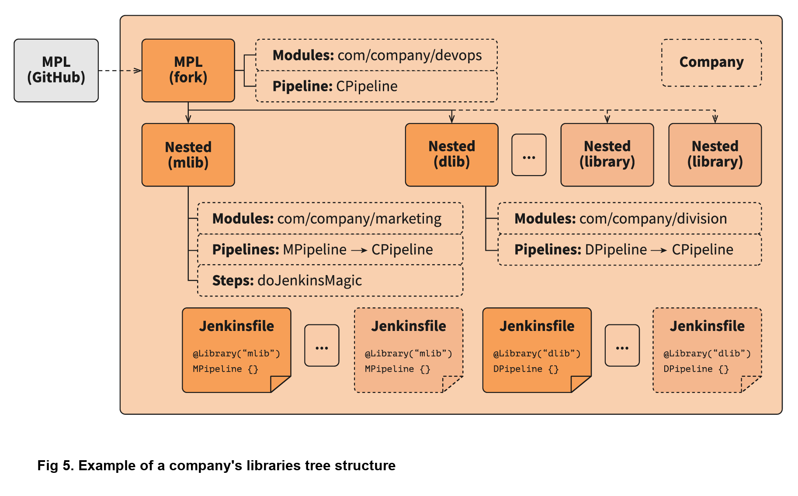
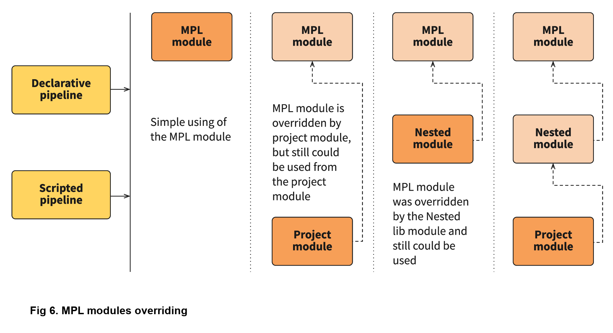
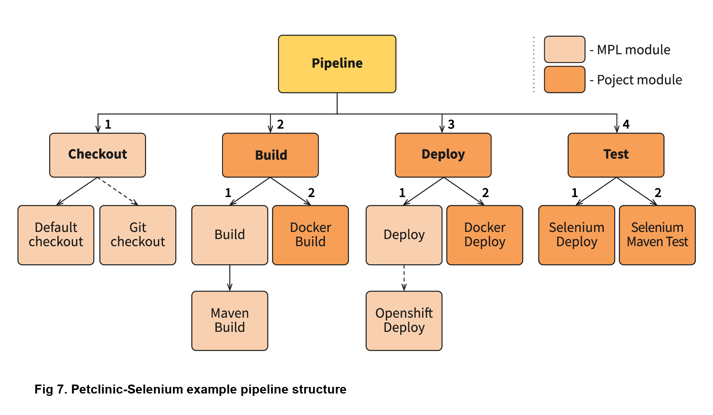

### MPL - 模块化的流水线库

尽管通过自动化部署加快了开发速度，但由于在 DevOps 方面缺少协作，我们一个客户正因此而放慢产品的上市时间。虽然他们也投入了资源来做 DevOps ，但每条生产流水线都是独立设置的，迫使团队为每个项目重新造轮子。更糟糕的是，由于没有跨团队协作，平台中的任何错误又会出现在每条新的流水线中。许多客户都有类似的问题存在，因此我们决定开发一个既能帮助现有客户，又能适应未来使用需求的通用工具。使用通用框架且标准化的 CI/CD 平台是最显而易见的选择，但这将导致缺少灵活性的单体结构（monolithic structure），最终会变得举步维艰。每个团队都需要在自己的流水线上工作，基于此，我们开发了一个方便 DevOps 流水线的每个可重用部分可供以后使用的解决方案 — Jenkins 驱动的模块化流水线库。


### 解决方案：模块化流水线库

模块化流水线库（译注：modular pipeline library，简称 MPL）是一个高度灵活的 Jenkins 流水线共享库，它可以轻松将最佳实践共享到整个公司。它具有清晰的模块化结构，先进的测试框架，多级嵌套的能力，流水线配置系统，被改进了的错误处理机制以及许多其他有用的组件。

我们将通过以下几部分内容深入了解并解释 MPL 是如何工作的：

1.  探索用于构建 MPL 的技术和工具
2.  回顾MPL，并说明它为何有效
3.  一步一步在流水线样例中使用 MPL
4.  深入研究 MPL 的一些重要的组件，例如测试框架和嵌套库

首先，让我们介绍构建 MPL 时使用到的关键技术。

### 使用共享库和 Jenkins 流水线构建 MPL

我们的 Jenkins 自动化平台最近收到了一些 Jenkins 流水线的更新。这些更新允许我们创建一个 Jenkinsfile 文件来描述整条流水线，并用于执行一系列不言自明的脚本。这提高了最终用户对 CI/CD 自动化流程的可视化程度，并提高了 DevOps 团队对流水线的可支持性。

然而，流水线存在一个很大的问题：很难用唯一的流水线支持多个 Jenkinsfile 文件（因此存在多少个项目就存在多少个 Jenkinsfile 文件）。我们需要一个地方存放公共逻辑，这正是 Jenkins 共享库能够实现的。共享库用于存放流水线公共的部分，它定义在 Jenkinsfile 文件中，并允许在其中使用接口简化自动化脚本。

虽然共享库允许你存储公共逻辑并操作 Jenkins，但它们并没有提供一种好的方式去使用这些公共逻辑。所以，MPL 通过允许用户创建易于理解的流程描述来优化流水线和共享库，然后方便其他团队使用。


### MPL 致力于创建跨团队协作 DevOps 流程

通过 MPL，我们现在能够跨团队协作和共享 DevOps 实践，轻松地为特定的项目指定特定的流水线，并能在将它们集成到 MPL 库中之前进行调试和测试。每个团队都可以创建一个嵌套库，在其中增加流水线和模块，并在流水线中使用，这样还可以提高流水线的可视化程度。MPL 能够适用于任何包含 Jenkinsfile 文件的项目，还可以根据项目团队的需要灵活地管理它。

MPL 的核心是提供一种简单的方法：

* 通过引入模块分离流水线和步骤
* 使用简单的接口描述模块中的步骤
* 测试所描述的模块并与其他流水线和项目共享结果

MPL 中还有许多其他功能，但本质上它是一个解决 DevOps 一般性协作问题的平台。为了简化开发和手动测试，MPL 提供了模块覆盖和继承模型，允许用户在不影响其他任何情况下测试项目中的特定修复。在 Jenkins 中，一个模块就是一个文件，其中包含脚本步骤和逻辑，以实现简单的目标（构建工件，运行测试，创建图像等）。这些模块在流水线的阶段中可以被组合使用，而且任何了解 Jenkins 流水线语法的人都可以轻松读懂。

MPL 允许用户使用库的核心特性（结构，模块，管道）并创建嵌套库以满足特定 DevOps 团队的需求。DevOps 团队可以在他们的项目中使用任何自定义的逻辑来组装一条完整的流水线。他们还可以通过多种方式覆盖和继承核心 MPL 模块，或者轻松地与其他团队分享自定义模块。接下来的信息，展示了这些模块的适用范围：



你还可以在模块中指定某些流水线所需的后续步骤。例如，动态部署模块的执行会创建测试环境，当流水线结束时，它又会销毁该测试环境。想要仔细查看 MPL 调用过程，请查看下图：



此图显示了 MPL 的执行。首先，你必须创建一个 Jenkins 任务，它将调用 Jenkinsfile（例如，当源代码被更改时），之后 Jenkinsfile 将调用流水线。流水线逻辑可以被定义在这些位置：MPL 端、Jenkins 任务的流水线脚本中 、嵌套库或项目 Jenkinsfile 中。最后，流水线的各个阶段将调用模块，而这些模块所使用的特性，可能来自 groovy 逻辑，流水线步骤或者共享库中的步骤。

现在我们已经完成对解决方案的概述，接下来，让我们通过一个简单的流水线来了解 MPL 是如何工作的。

### 流水线在 MPL 中执行的示例

假设你有一个常规的 Java Maven 项目。你在项目中创建 Jenkinsfile，并希望使用 DevOps 团队准备的默认流水线。MPL 本身就提供一个简单的流水线：核心 MPLPipeline 。这是一个非常简单的流水线，但对于想要尝试 MPL 的人来说，这是一个很好的开端。我们来看一下这个简单的 Jenkinsfile 文件：


```groovy
@Library('mpl') _
MPLPipeline {}
```

这个 Jenkinsfile 文件只包含两行代码，一行加载 MPL 逻辑，另一行运行流水线。大多数的共享库实现了像这样的接口，调用步骤并提供参数。MPLPipeline 只是一个自定义的流水线步骤，因为它位于 vars 目录中。MPLPipeline 结构非常简单，执行步骤如下：

1. 初始化 MPL MPL 使用 MPLManager 单例对象来控制流水线
1. 使用默认值合并配置并将其存储
    指定阶段所需的默认配置并预定义一些有用的配置
1. 定义一个包含4个阶段和后续步骤的声明式流水线：
  1. 检出（Checkout）- 获取项目源代码
  2. 构建（Build）- 编译，静态分析，单元测试
  3. 部署（Deploy）- 将制品上传到动态环境（dynamic environment）并运行应用程序
  4. 测试（Test）- 检查与其他组件的集成
  5. 后续步骤（Poststeps）- 清理动态环境，发送通知等
1. 运行已定义的流水线 
  这是 MPL 开始发挥其魔法并实际运行的地方

MPL 的主要阶段只有一步，即 [MPLModule](https://github.com/griddynamics/mpl/blob/master/vars/MPLModule.groovy#L29)。此步骤包含 MPL 的核心特性：执行包含流水线逻辑的模块。你可以在 MPL 代码仓库中找到默认模块，这些模块位于 resources/com/griddynamics/devops/mpl/modules 目录中，包括：Checkout，Build，Deploy 和 Test 模块。在每个模块的目录中，我们都可以找到真正执行相应阶段逻辑的 Groovy 文件。下图是简化了的 MPL 代码仓库结构图：




检出阶段启动时，MPLModule 按名称加载模块（默认为阶段名称），并运行 Checkout/Checkout.groovy 文件中的逻辑：


```groovy
if( CFG.'git.url' )
  MPLModule('Git Checkout', CFG)
else
  MPLModule('Default Checkout', CFG)
```

如果配置中包含该 git.url 选项，它将加载一个 Git Checkout 模块。否则，它将运行该 Default Checkout 模块。所有被调用的模块使用与父模块相同的配置，这就是 CFG 被传递给 MPLModule 调用的原因。在以上代码中，我们没有指定 git.url 配置，因此它将运行 Checkout/DefaultCheckout.groovy 中的逻辑。模块名称中的空格是将模块映射到特定文件夹的分隔符。

在 Default Checkout 模块中，只有一行代码 checkout scm，它负责克隆 Jenkins 任务中指定的源代码仓库。这就是检出阶段所做的一切，MPL 对于这么小的阶段似乎有些多余，我们只需要在这里讨论它，以展示 MPL 在模块中的工作方式。

当流水线运行 Maven Build 模块时，也是同样的运行逻辑：


```groovy
withEnv(["PATH+MAVEN=${tool(CFG.'maven.tool_version' ?: 'Maven 3')}/bin"]) {
  def settings = CFG.'maven.settings_path' ? "-s '${CFG.'maven.settings_path'}'" : ''
  sh """mvn -B ${settings} -DargLine='-Xmx1024m -XX:MaxPermSize=1024m' clean install"""
}
```

这个阶段稍微复杂一些，但是操作很简单：我们使用默认名称为 Maven 3 的工具来运行 mvn clean install 命令。这些模块是脚本化的流水线（scripted pipeline），所以你可以执行所有 Jenkins 流水线支持的步骤。这些文件不需要任何特定的和复杂的语法，只需要一个普通的文件，其中包含步骤和 CFG, CFG 是包含了阶段配置的预定义变量。MPL 模块从父模块继承了沙盒（sandbox），因此你的脚本执行将是安全的，并且和一个普通的 Jenkins 流水线一样在 Jenkins 重启后还能生效。

在 Deploy 文件夹中，Openshift Deploy 模块具有相同的结构。它的主要目的中是为了展示如何在模块中定义后续步骤（poststep）：

```groovy
MPLPostStep('always') {
  echo "OpenShift Deploy Decommission poststep"
}
echo 'Executing Openshift Deploy process'
```

首先，我们定义了 always 后续步骤。它最终会被存放到 MPLManager 对象中（译注：https://github.com/griddynamics/mpl/blob/master/src/com/griddynamics/devops/mpl/MPLManager.groovy#L40），在真正执行后续步骤时被调用。我们可以多次定义 always MPLPostStep：所有后续步骤都将按先进后出（FILO）顺序存放和执行。因此，我们可以在同一模块中定义需要完成和撤消操作的后续步骤逻辑，例如动态环境的销毁。这样就可以确保在流水线完成时执行操作。

在部署阶段之后，流水线会执行测试阶段，但是在测试阶段并没有太多有趣的事情发生。然而，测试中有一个非常重要的事情，那就是 MPL 本身的测试。

### MPL 本身的测试

MPL 的测试框架基于 LesFurets 的 [JenkinsPipelineUnit](https://github.com/jenkinsci/JenkinsPipelineUnit)，其中一个很小的区别是它能够测试 MPL 模块。测试整个流水线被认为是不现实的，因为流水线可能非常复杂，为这些怪物编写测试就像一项西西弗斯任务（sisyphean task，译注：永无尽头而又徒劳无功的任务）。而使用用少量的步骤测试一个黑盒要容易得多，可以确保任务能正常工作。

在 MPL 源代码中，你可以找到构建模块的测试用例：所有测试都存放在 test/groovy/com/griddynamics/devops/mpl/modules 目录中，Build/BuildTest.groovy 文件内有多个测试用例。MPL 库的构建阶段会执行这些测试，测试的步骤如下：

```groovy
Loading shared library mpl with version snapshot
  MPLModule.call(Build, {maven={tool_version=Maven 2}})
    Build.run()
      Build.MPLModule(Maven Build, {maven.tool_version=Maven 2})
        MavenBuild.run()
          MavenBuild.tool(Maven 2)
          MavenBuild.withEnv([PATH+MAVEN=Maven 2_HOME/bin], groovy.lang.Closure)
            MavenBuild.sh(mvn -B  -DargLine='-Xmx1024m -XX:MaxPermSize=1024m' clean install)
      Build.fileExists(openshift)
```

测试运行 MPLModule 自定义配置和模拟步骤，以检查在执行期间，工具是否已根据提供的配置更改为 Maven 2。我们使用此类测试覆盖所有测试用例，确保模块按预期工作，并且流水线将正常工作。如果需要，你可以测试整条流水线，但模块测试是简化测试过程的一种方法。

现在我们已经了解了如何测试 MPL 模块，现在是时候看看 MPL 的一个关键特性，即嵌套库。

### 嵌套库的好处

在大型公司中，支持一个大型库是没有意义的。每个部门都需要多个（不同于标准的）配置选项，并针对标准流水线进行调整，这会带来不必要的工作量。MPL 通过引入嵌套库来解决这些问题。下图展示了使用嵌套库与仅仅使用主库的区别：



嵌套库与共享库相同，都通过导入 MPL 使用其特性，模块和流水线。此外，它允许将一些与团队相关的逻辑与公司的通用逻辑分离。以下是具有嵌套库的 MPL 的结构：



你可以在重写的流水线中导入 MPL，指定一些附加模块的路径，覆盖模块逻辑，并由 Jenkins 负责协调（译注：此处原文是You can import the MPL in the overridden pipeline, specify the path of some additional modules, override module
logic, and use Jenkins power moves: there are no limitations. 本人能力有限，无法真正理解作者的意思）。当另一个团队需要你的模块时，你只需向公司 MPL 基础仓库提交变更请求，如果变更请求通过，就可以与他们共享你的功能模块。

因为嵌套库可以覆盖 MPL 或 Jenkins 流水线的基本功能，所以嵌套库可以调试和修改 MPL 提供的步骤（例如 MPLModule）和流水线。你可以覆盖任何功能，因为这些覆盖仅影响你自己的流水线。经常验证的嵌套库，可以与其他团队讨论，看看它是否也适用于其他嵌套库。

嵌套库的嵌套层级数是没有限制的，但我们建议仅使用两层级（ MPL 和嵌套库），因为在低层级上配置和测试嵌套库非常复杂。

### 强大的模块覆盖

进一步了解嵌套库和项目端模块后，我们知道，模块名称是可以与上层库中模块名同名的。这是覆盖上层模块逻辑的好方法——使用自己的模块替换
Build/Build.groovy——真正执行时就会执行你的模块中的逻辑，而不是上层模块的。下图说明了模块覆盖是如何工作的：



更棒的是，MPL 的优点之一是你仍然可以使用上层模块！MPL 具有防止循环调用的机制，因此同一运行分支中不会再次运行同一模块。但是，你可以轻松地通过在一个模块中调用原始模块来使用上层逻辑。



上面的 Petclinic-Selenium 示例中，使用了默认值 MPLPipeline（您可以在 [MPL Wiki](https://github.com/griddynamics/mpl/wiki) 页面上找到它），并在 .jenkins 目录中包含项目级别模块。这些模块将在库模块之前调用。例如，Checkout 模块没有放在项目级别，因此它将从 MPL 调用，但 Build 模块存在于 .jenkins 项目端的目录中，它将被调用：

```groovy
MPLPostStep('always') {
  junit 'target/surefire-reports/*.xml'
}

MPLModule('Build', CFG)

if( fileExists('Dockerfile') ) {
  MPLModule('Docker Build', CFG)
}
```

如代码所示，项目中的 Build 模块注册了后续步骤，接着调用原始的 Build 模块，最后调用 Docker Build 模块。流水线的后续阶段更复杂，但所有模块覆盖基本原理都相同。现实中，有些项目可能很棘手，需要对现有模块进行一些小调整。但是，你可以在项目级别的模块中轻松调整，并考虑如何将功能移动到嵌套库或 MPL 中。

### 结论：MPL 为 DevOps 带来了什么
许多 DevOps 团队和公司都使用臃肿，限制多的的和错误的 CI/CD 自动化平台。这增加了用户的学习曲线，导致团队工作更慢，并提高了生产成本。DevOps 团队发现，相同的问题经常在不同的项目中出现，而缺乏协作意味着团队每次都必须单独修复它们。

但是，通过 MPL，DevOps 团队拥有一个共享、简单、灵活的 CI/CD 平台。可以改善生产过程中的用户支持，协作和整体项目源代码。通过利用 MPL，你的公司可以找到自动化共识，实现跨公司协作的目标，并重用来自大型社区的最佳实践。而且这些都是开源工具。如果你对构建 MPL 感兴趣，请联系我们以了解更多信息！

### 其他资源
* [Jenkins Pipeline Engine](https://jenkins.io/doc/book/pipeline/#overview)
* [Jenkins Shared Libraries](https://jenkins.io/doc/book/pipeline/shared-libraries/#extending-with-shared-libraries)
* [MPL GitHub repository](https://github.com/griddynamics/mpl)

###  概述和演示视频：

* [介绍](https://youtu.be/NpnQS3fFlyI)
* [概述](https://youtu.be/wwi7oREL02k)
* [MPL Build的演示](https://youtu.be/QZsQThhPk-Y)
* [嵌套库的演示](https://youtu.be/UsThHFze76Y)
* [流水线的演示](https://youtu.be/GLtvxY1S3Aw)